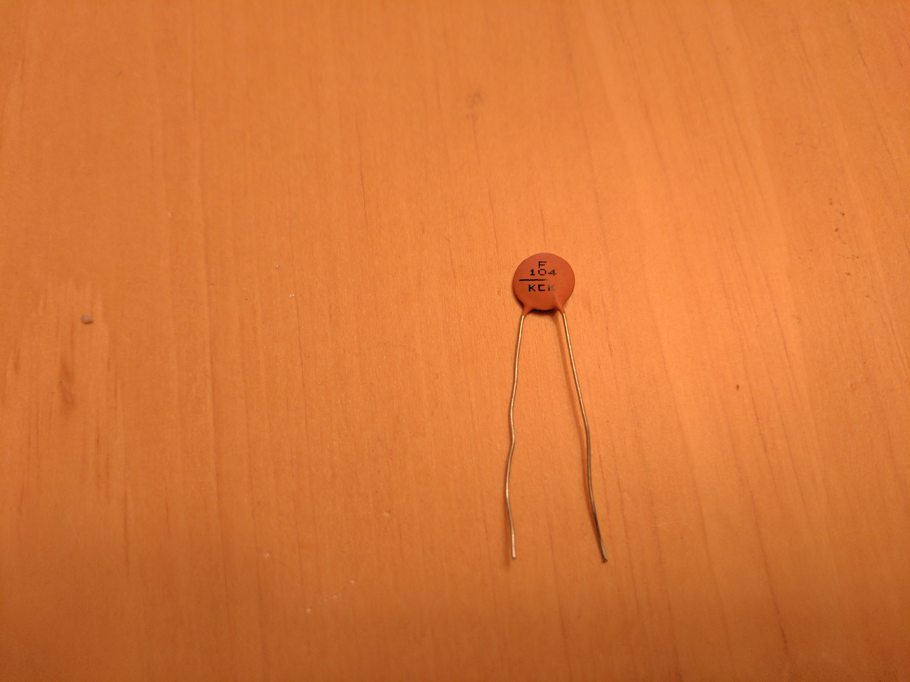

# CNC-Stepper
PBL module to build a CNC Machine

# Stepper Motor Control

## Introduction:

This project will provide a background for controlling stepper motors using a basic microcontroller. The goal of this project is to build a machine that is able to produce accurate and repeatable drawings. Students will be provided with resources on types of stepper motors, how they work, and what their purpose is in advanced manufacturing tools. Students will gain experience in breadboard prototyping, basic electronic circuits, uploading and editing code to control motors using a microcontroller, and using existing libraries to connect with a computer to develop complex control functions. This project is intended to use common and cheap materials and parts in order to develop a basic understanding of these concepts.

## Standards:

### Next Generation Science Standards

HS Energy - [HS PS3-1-4](https://www.nextgenscience.org/topic-arrangement/hsenergy)

HS Engineering - [HS ETS1-1-4](https://www.nextgenscience.org/dci-arrangement/hs-ets1-engineering-design)

### Virginia DOE Standards of Learning

Physical Science - [PS1, 10, 11](http://www.doe.virginia.gov/testing/sol/standards_docs/science/courses/stds_physical_sci.pdf)

Mechatronics - [Competencies 57-88](http://www.cteresource.org/verso/courses/8554/mechatronics-i-tasklist)

### Manufacturing Technician Level 1

**Standards:**
+ Category I: Math & Measurement  
+ Category II: Spatial Reasoning & Manufacturing Technology

## Getting Started:

Below we will talk about stepper motors and how to control them for specific purposes. To begin, you will need:


[28BYJ-48 5V Unipolar Stepper Motor](http://robocraft.ru/files/datasheet/28BYJ-48.pdf)


[Arduino Uno/Nano microcontroller](https://www.arduino.org)


Jumper Wires


[ULN2003A Darlington Transistor Array IC](http://www.ti.com/lit/ds/symlink/ulq2003a.pdf)



[.1μF Ceramic Capacitor](http://www.sphere.bc.ca/test/production-parts/avx-rad-cer-thomson.pdf)


[.1" Breadboard](http://www.ti.com/lit/ds/symlink/ulq2003a.pdf)


USB Cable

Follow the wiring diagram developed on [Fritzing](http://www.fritzing.org/). The ULN2003 integrated circuit is several transistors in a row. You can attach an input from another device and the output will be controlled by the NPN Darlington transistors on the output pin. The [Darlington transistors](https://en.wikipedia.org/wiki/Darlington_transistor) consists of two bipolar transistors connected to amplify the current through each of the transistors. The ULN2003 chip has 7 inputs and 7 outputs. The [decoupling capacitor](https://learn.sparkfun.com/tutorials/capacitors/application-examples) will act as a smoothing filter for higher frequencies coming from the power supply. This will especially be useful when using an external power supply. The 2BYJ-48 Unipolar Stepper Motor must be connected to the 5V source. The other wires are in pair for each coil and must be connected properly. The Orange & Pink wires are a pair and the Yellow and Blue are a pair.

<div class="w3-row-padding">

 Schematic of single stepper motor wiring. Use this to create your circuit.

 Prototype your circuit on a breadboard before beginning.

  

ULN2003 Pinout  

Source: [www.ti.com/lit/ds/symlink/uln2003a.pdf](../www.ti.com/lit/ds/symlink/uln2003a.pdf)</div>

 Double check all of your connections before plugging the Arduino into your computer. If you need to make any changes, be sure to unplug the Arduino 5V before continuing.

Once you are sure about your wiring, we are going to upload some basic code to test the motor through the [Arduino IDE](https://www.arduino.cc/en/Main/Software). Check out the getting started page for more information about uploading code to the Arduino microcontroller. The code below should continously spin the motor in one direction. It is based off the 4-phase motor capabilities and allowing the inputs to be switched fast enough and in sequence to switch the phases to make a full rotation.

```
Pin0 = 2;  
int Pin1 = 3;  
int Pin2 = 4;  
int Pin3 = 5;  
int _step = 0;  
boolean dir = true;  

void setup()  
{  
 pinMode(Pin0, OUTPUT);  
 pinMode(Pin1, OUTPUT);  
 pinMode(Pin2, OUTPUT);  
 pinMode(Pin3, OUTPUT);  
}  

void loop()  
{  
 switch(_step){  
  case 0:  
   digitalWrite(Pin0, LOW);  
   digitalWrite(Pin1, LOW);  
   digitalWrite(Pin2, LOW);  
   digitalWrite(Pin3, HIGH);  
  break;  
  case 1:  
   digitalWrite(Pin0, LOW);  
   digitalWrite(Pin1, LOW);  
   digitalWrite(Pin2, HIGH);  
   digitalWrite(Pin3, HIGH);  
   break;  
   case 2:  
   digitalWrite(Pin0, LOW);  
   digitalWrite(Pin1, LOW);  
   digitalWrite(Pin2, HIGH);  
   digitalWrite(Pin3, LOW);  
   break;  
   case 3:  
   digitalWrite(Pin0, LOW);  
   digitalWrite(Pin1, HIGH);  
   digitalWrite(Pin2, HIGH);  
   digitalWrite(Pin3, LOW);  
   break;  
   case 4:  
   digitalWrite(Pin0, LOW);  
   digitalWrite(Pin1, HIGH);  
   digitalWrite(Pin2, LOW);  
   digitalWrite(Pin3, LOW);  
   break;  
   case 5:  
   digitalWrite(Pin0, HIGH);  
   digitalWrite(Pin1, HIGH);  
   digitalWrite(Pin2, LOW);  
   digitalWrite(Pin3, LOW);  
   break;  
  case 6:  
   digitalWrite(Pin0, HIGH);  
   digitalWrite(Pin1, LOW);  
   digitalWrite(Pin2, LOW);  
   digitalWrite(Pin3, LOW);  
   break;  
   case 7:  
   digitalWrite(Pin0, HIGH);  
   digitalWrite(Pin1, LOW);  
   digitalWrite(Pin2, LOW);  
   digitalWrite(Pin3, HIGH);  
   break;  
   default:  
   digitalWrite(Pin0, LOW);  
   digitalWrite(Pin1, LOW);  
   digitalWrite(Pin2, LOW);  
   digitalWrite(Pin3, LOW);  
  break;  
 }  
 if(dir){  
   _step++;  
 }else{  
  _step--;  
 }  
 if(_step>7){  
  _step=0;  
 }  
 if(_step<0){  
  _step=7;  
 }  
 delay(1);  
}
```

Below is a chart of what the motor is doing during rotation and what coils are being activated. This represents the long form code above of turning inputs on and off in sequence.

| WIRE       | STEP | STEP | STEP | STEP | STEP | STEP | STEP | STEP |
|------------|------|------|------|------|------|------|------|------|
| 4 PHASE    | -    | 1    | -    | 2    | -    | 3    | -    | 4    |
| 8 PHASE    | 1    | 2    | 3    | 4    | 5    | 6    | 7    | 8    |
| BLUE (1)   | 1    | 1    | 0    | 0    | 0    | 0    | 0    | 1    |
| PINK (2)   | 0    | 1    | 1    | 1    | 0    | 0    | 0    | 0    |
| YELLOW (3) | 0    | 0    | 0    | 1    | 1    | 1    | 0    | 0    |
| ORANGE (4) | 0    | 0    | 0    | 0    | 0    | 1    | 1    | 1    |
| RED        | Vcc  | Vcc  | Vcc  | Vcc  | Vcc  | Vcc  | Vcc  | Vcc  |

We will now control the motor using the standard [stepper library](https://www.arduino.cc/en/Reference/Stepper) built into the Arduino IDE. This library will provide a few functions to control the four in four phases. Test out the code below and change some of the values. This should do a half turn one way slow and back the other way quickly. This particular motor has 32 steps per revolution. It is then multiplied by 64 as it is a gear reduction stepper motor. This will provide the correct rotation for the motor.

```
#include "Stepper.h"  
#define STEPS_PER_MOTOR_REVOLUTION 32  
#define STEPS_PER_OUTPUT_REVOLUTION 32 * 64  
Stepper small_stepper(STEPS_PER_MOTOR_REVOLUTION, 2, 3, 4, 5);  
int Steps2Take;  

void setup()  
{  
}  

void loop()  
{  
 small_stepper.setSpeed(1);  
 Steps2Take = 4;  
 small_stepper.step(Steps2Take);  
 delay(2000);  
 Steps2Take = STEPS_PER_OUTPUT_REVOLUTION / 2;  
 small_stepper.setSpeed(100);  
 small_stepper.step(Steps2Take);  
 delay(1000);  
 Steps2Take = - STEPS_PER_OUTPUT_REVOLUTION / 2;  
 small_stepper.setSpeed(700);  
 small_stepper.step(Steps2Take);  
 delay(2000);  
}
```

You may try other libraries that provide more complex control over motors like [AccelStepper](http://www.airspayce.com/mikem/arduino/AccelStepper/) or the [Stepper2](https://gist.github.com/sbright33/4178431) for Arduino.

## Project:

Understanding stepper motors and how to control them will give us a better understanding of advanced manufacturing tools and how they work. We will design a basic plotter that can draw accurate line drawings that can be easily repeated. We will utilize simple materials and design in order to make a Computer Numeric Controlled (CNC) plotter that can be adjusted in software and firmware. Not only will the plotter be able to move along the X and Y axis, it will have the abilty to draw or plot designs input from a user. We will take advantage of the cheap 28BYJ-48 Stepper Motors and the ULN2003 Darlington Transistor IC to drive the motors. This excercise will require a platform, guides in two directions, and a marking device at the minimum. You may utilize existing firmware ([GRBL](https://github.com/gnea/grbl/wiki)) or write your own. This project will also require a separate 5V power supply of ~1A to properly drive the stepper motors throughout a more complicated routine.

**Requirements:**

*   Use 2 stepper motors for X and Y axis movement
*   Use a microcontroller to control rotation of motors
*   Plot a 10mm diameter circle on a piece of paper using a drawing device
*   Add one unique feature to the machine
*   Create a circuit diagram of the system including, microcontroller, motors, drivers, power supply, and passive components

**Documentation:**

*   Bill of Materials
*   Circuit Diagram
*   Firmware
*   Build Instructions
*   Video of Machine making 10mm circle
*   Reflection of Machine

**Additions:**

*   Cooling for motors and drivers
*   Servo motor or additional stepper motor to control pen movement in the Z direction
*   SD Card
*   LCD Screen UI
*   Material Hold Down
*   Tool Changer
*   Modular Parts
*   Unique System Printed Circuit Board (PCB)
*   Handheld Pendant
*   Specific Purpose (PCB Ink Plotting, Art, Line Drawings, Vinyl Cutter, Spindle, etc.)
*   Open Source Hardware Design

## Examples:

Below is an example video making a 5mm circle and testing the electronics and the serial control through [UniversalGCodeSender](https://winder.github.io/ugs_website/). The circle was designed in [OpenSCAD](http://www.openscad.org/) and converted to GCode using [MakerCAM](http://www.makercam.com/):

[Test Video](https://www.youtube.com/embed/37nOorFOJGQ)

The next video shows movement of the Y axis table using a linear bearing and simple materials. The base is made of 3/4" plyood, the bearing is mounted to the base using drilled and tapped steel bar, and the table is made from 1/4" MDF. The pulley system is monofilament nylon wire wrapped around the stepper and connected to the table. The program is simulating making a 1" square to show the independent movement of each motor:

[Test Video 2](https://www.youtube.com/embed/woxuyiv3Xu4)

**Other Great Projects:**

[MTM Snap Together CNC Mill - Jonathan Ward](http://mtm.cba.mit.edu/machines/mtm_snap-lock/index.html)  
[Direct to Ink PCB Plotter - Dirk Herrendoerfer](https://www.youtube.com/watch?v=kcXlak7RNV0)  
[$200 Mill That Doesn't Suck - Timo Birnschein](https://hackaday.io/project/25356-sub-200-pcb-mill-that-doesnt-suck)  
[Laser Cut Plotter - Morton Ydefeldt](https://hackaday.io/project/3840-laser-cutted-plotter)  
[Pocket Laser Engraver - Groover](http://www.instructables.com/id/Pocket-laser-engraver/)  
[CD Drive Mini Plotter - Adi Dax](http://www.makerblog.at/2015/02/projekt-mini-cnc-plotter-aus-alten-cddvd-laufwerken/)  
[3D Printed CNC Mill](http://www.instructables.com/id/3D-printed-CNC-mill/) or [3D Printed & Laser Cut Mill](https://www.thingiverse.com/thing:826098)  

## Assessment:

* Demonstration of controlling 2 stepper motors with written or verbal explanation of the process
_Do your stepper motors do what you wanted them to do?_

_What is happening in the system?_

* All iterations of circuit design/schematic, checked by two other students, with comments included
_Does your circuit design or schematic match your actual circuit?_

_What changes were made to your original circuit designs_

_What did others say about your design? Was it clear and complete_

* Documentation of machine build, including aspects of testing functionality, your troubleshooting process throughout the build
_Have you listed all the steps with pictures and/or videos explaining the main components of your build?_

_Could someone else follow your guide to build their own version of your CNC machine?_

_How did you test your design throughout this process? What went wrong and how did you decide how to fix it?_

_Did you include a bill of materials and design files?_

_Can you explain the firmware used in this project?_

* Reflection of learning and machine, including reasoning for unique aspect of your design
_What worked well for you? What was a struggle?_

_How did you come up with your idea for the final machine?_

_What other major applciations could stepper motors come into use?_

_If you could redo this project, what would you do? Why?_

_Why did you design your machine the way you did? What makes your design unique?_

_What is your current understanding of stepper motors as a result of this project?_

_Does you machine make a 10mm circle? What is the tolerance of the machine?_

_What questions do you still have?_

* Interview of another student using your machine with feedback
_How did the other student use your machine? Was everything straightforward as intended?_

_What was easy to use? What was difficult?_

_What worked really well? What could be improved?_

_General thougts and design considerations..._

## Resources
[Next Generation Science Standards](https://www.nextgenscience.org/)  
[Tom Igoe - Stepper Motors](http://www.tigoe.net/pcomp/code/circuits/motors/stepper-motors/)  
[Adafruit - Types of Stepper Motors](https://learn.adafruit.com/all-about-stepper-motors/what-is-a-stepper-motor)  
[Microstepping: Myths and Realities](https://www.micromo.com/media/wysiwyg/Technical-library/Stepper/6_Microstepping%20WP.pdf)  
[4 Common Production Line Problems, How Modern Motors Can Help](http://www.machinedesign.com/motorsdrives/4-common-production-line-problems-how-can-modern-motors-help)  
[Adafruit - Stepper Motor Tutorial](https://learn.adafruit.com/adafruit-arduino-lesson-16-stepper-motors/overview)  
[uCNC_Controller](https://github.com/dherrendoerfer/uCNC_controller)  
[GRBL-28BYJ-48-Servo Firmware](https://github.com/ruizivo/GRBL-28byj-48-Servo)  
[GRBL CNC Firmware](https://github.com/gnea/grbl/wiki)  
[Inkscape GCODETOOLS Extension](https://github.com/cnc-club/gcodetools)  
[Inkscape Unicorn GCODE Tool](https://github.com/martymcguire/inkscape-unicorn)
